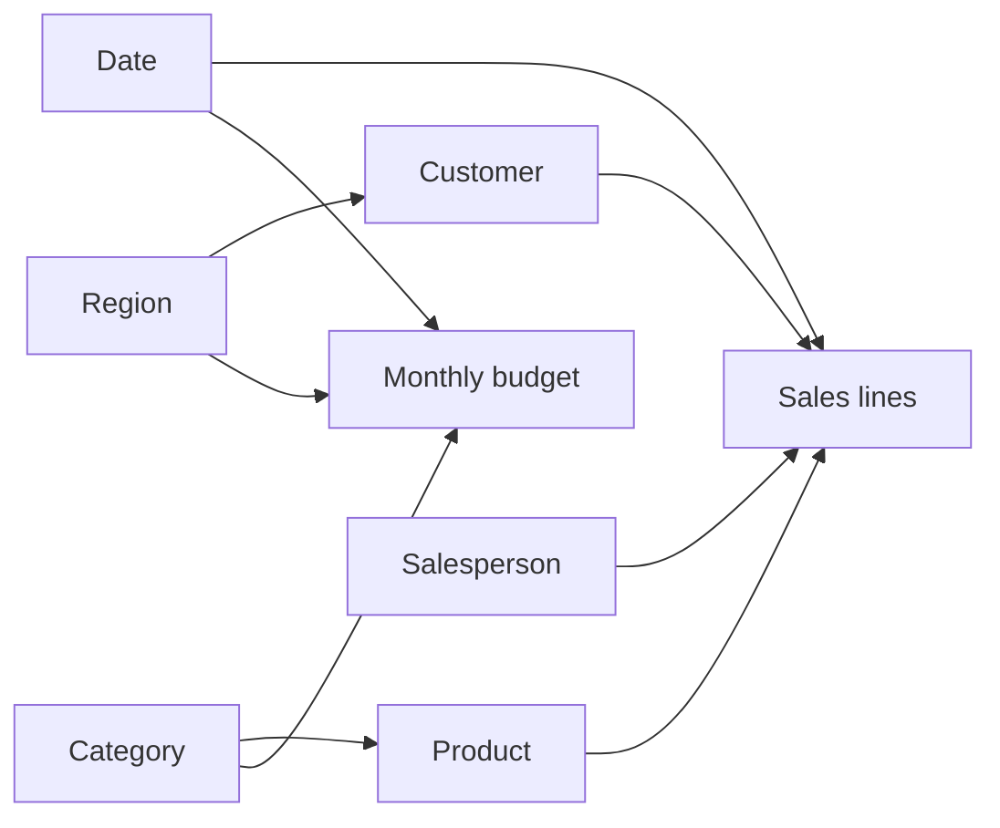

# Model and metric definitions

## Plain-language model explanation

Sales contains one row for each product line in a customer order. Product, customer, date, and salesperson tables describe those rows. Budget contains planned revenue by month, region, and category.

Shared region and category dimensions let the same selection filter both sales and budget. Budget dates use each month’s first day, so budget comparisons must use whole months. Relationships are one-to-many and filter in one direction.

## Metrics

- **Revenue:** sum of `net_sales`; sales after discounts.
- **Gross profit:** sum of `gross_profit`; revenue minus product cost (`cogs`). This excludes operating expenses.
- **Gross margin:** total gross profit / total revenue.
- **Revenue growth:** current matching-period revenue / prior-year matching-period revenue − 1.
- **Gross profit growth:** the equivalent calculation using gross profit.
- **Revenue budget:** sum of `revenue_budget`, independently aggregated from monthly budget rows.
- **Budget variance (KES):** actual revenue − budget revenue.
- **Budget variance (%):** (actual revenue − budget revenue) / budget revenue.
- **Category share of net shortfall:** category shortfall / total net shortfall. Favorable categories offset shortfalls in this denominator.
- **Average discount:** unweighted arithmetic mean of sales-line `discount_pct`. This is not a revenue-weighted effective discount.

Currency is KES. Main comparison: January–August 2026 against January–August 2025. Rounded display values may not reproduce ratios exactly; calculations use unrounded values.

## Safeguards

Budgets have no channel dimension. The report-specific budget measures return blank when channel is filtered. Budgets are not allocated to days. No stockout, delivery cost, net profit, or causal discount effect is inferred.

The reproducible script checks unique keys, joins, budget grain, coverage, and total reconciliation. The Power BI model uses embedded snapshots; refreshing visuals does not load changed local files. A new source snapshot must be deliberately imported.

## Sensitivity, not a forecast

At unchanged revenue of KES 24,023,981.09, a one-percentage-point margin increase corresponds to KES 240,239.81 additional gross profit. It assumes unchanged revenue and is not a promised saving or forecast. Volume, mix, and customer behaviour could change the outcome.
